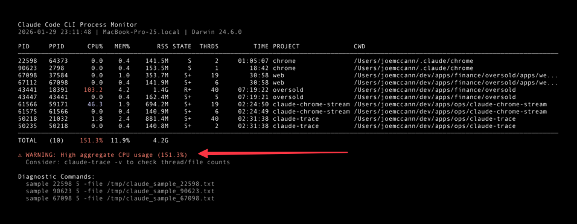

<p align="center">
  
</p>

<p align="center">
  <strong>Your Claude Code is slow. Here's why.</strong>
</p>

<p align="center">
  <a href="#installation">Install</a> •
  <a href="#quick-start">Quick Start</a> •
  <a href="#tools">Tools</a> •
  <a href="#diagnostic-workflow">Workflow</a>
</p>

---

Stop guessing why Claude Code is eating your CPU. **Claude Trace** gives you instant visibility into every Claude process running on your machine — CPU spikes, memory leaks, runaway file watchers, the works.

Built with **Bash + Rust** for zero-dependency monitoring that's as fast as the problems it finds.

## Quick Start

```bash
# See all Claude processes right now
./claude-trace

# Watch mode — refreshes every 2 seconds
./claude-trace -w

# Something's wrong? Go deep.
./claude-diagnose --pid <PID> -d -s
```

### See Everything at a Glance

Run `./claude-trace -v` to get a full picture of every Claude session on your machine — which projects they're in, how much CPU and memory they're consuming, and how long they've been running.

<p align="center">
  
</p>

When aggregate CPU exceeds 100%, you'll get an instant warning with suggested diagnostic commands. No more wondering why your fan is spinning — now you know exactly which session to kill or investigate.

## Installation

```bash
# Clone the repository
git clone https://github.com/joemccann/claude-trace.git ~/claude-trace
cd ~/claude-trace

# Build the Rust diagnostic tool
cargo build --release

# Add to PATH
export PATH="$HOME/claude-trace:$HOME/claude-trace/target/release:$PATH"

# Or install the binary system-wide
sudo cp target/release/claude-diagnose /usr/local/bin/
sudo cp claude-trace /usr/local/bin/
```

## Development

A convenience script is provided for building and running the tools locally:

```bash
./dev.sh              # Build all and show status
./dev.sh build        # Build Rust binary only
./dev.sh trace        # Run the Bash monitor (claude-trace)
./dev.sh trace -v     # Run with verbose output
./dev.sh diagnose     # Run the Rust diagnostics (claude-diagnose)
./dev.sh watch 5      # Watch mode with 5s refresh
./dev.sh test         # Run tests and validate scripts
./dev.sh clean        # Clean build artifacts
```

## Tools

### `claude-trace` - Process Monitor (Bash)

Fast, lightweight Bash script for real-time process monitoring.

```bash
# One-shot process list
claude-trace

# Watch mode (refresh every 2s)
claude-trace -w

# Watch with 5s interval
claude-trace -w 5

# JSON output for scripting
claude-trace -j | jq '.totals.cpu_percent'

# Verbose mode with threads, project, and working directory
claude-trace -v

# Show process tree
claude-trace -t

# Warn when CPU exceeds threshold
claude-trace -k 50
```

**Output Fields:**
| Field | Description |
|-------|-------------|
| PID | Process ID |
| PPID | Parent Process ID |
| CPU% | CPU utilization percentage |
| MEM% | Memory utilization percentage |
| RSS | Resident Set Size (physical memory) |
| STATE | Process state (R=running, S=sleeping, S+=foreground) |
| TIME | Cumulative CPU time |
| COMMAND | Process command/arguments |

**Verbose Mode (`-v`) adds:**
| Field | Description |
|-------|-------------|
| THRDS | Thread count |
| PROJECT | Project name (basename of working directory) |
| CWD | Current working directory |

### `claude-diagnose` - Deep Diagnostics (Rust)

High-performance Rust binary for in-depth analysis including stack sampling and file descriptor inspection.

```bash
# Quick overview
claude-diagnose

# Deep analysis with file descriptor inspection
claude-diagnose -d

# Deep analysis with stack sampling (5s default)
claude-diagnose -d -s

# 10-second sample with JSON output
claude-diagnose -d -s --sample-duration 10 -j

# Analyze specific PID
claude-diagnose --pid 35072 -d -s

# Full help
claude-diagnose --help
```

**Diagnostic Capabilities:**
- Stack sampling via macOS `sample` command
- Hot function detection and ranking
- FSEvents watcher detection
- File descriptor leak detection
- Network connection enumeration
- Memory pressure analysis
- V8 GC pressure detection
- CFRunLoop spin detection
- **DTrace/dtruss syscall tracing**
- **Flamegraph generation**

### DTrace Syscall Tracing

Enable system call tracing for deep analysis of process behavior:

```bash
# Basic syscall trace (requires sudo)
sudo claude-diagnose -D --pid 35072

# 10-second trace with JSON output
sudo claude-diagnose -D --duration 10 --pid 35072 -j

# I/O focused trace (read, write, open, close, stat)
sudo claude-diagnose -D --io --pid 35072

# Network focused trace (socket, connect, send, recv)
sudo claude-diagnose -D --network --pid 35072
```

**Flamegraph Generation:**

Generate interactive SVG visualizations of syscall activity:

```bash
# Basic flamegraph (5s default duration)
sudo claude-diagnose -D --flamegraph --pid 35072 -o syscalls.svg

# I/O focused flamegraph
sudo claude-diagnose -D --io --flamegraph --pid 35072 -o io.svg

# Network focused flamegraph
sudo claude-diagnose -D --network --flamegraph --pid 35072 -o network.svg

# Longer trace (10s) for more comprehensive data
sudo claude-diagnose -D --flamegraph --duration 10 --pid 35072 -o syscalls.svg

# Open the generated flamegraph
open syscalls.svg
```

**DTrace Output Includes:**
| Field | Description |
|-------|-------------|
| Top Syscalls | Most frequently called system calls |
| Total Time | Cumulative time spent in each syscall |
| Avg Time | Average latency per syscall |
| Errors | Failed syscall count |
| I/O Operations | File read/write activity with paths |
| Network Operations | Socket operations with addresses |

**Flamegraph Features:**
- Syscalls grouped by category (file, network, memory, process, event)
- Width represents call frequency
- Interactive SVG - hover for details, click to zoom
- Also generates `.folded` file for use with external flamegraph tools

**SIP Considerations:**

On macOS with System Integrity Protection (SIP) enabled, DTrace may be restricted. The tool will:
1. Detect SIP restrictions automatically
2. Fall back to `fs_usage` for limited file system tracing
3. Report the fallback reason in output

To enable full DTrace support, you can disable SIP (not recommended for production) or use `csrutil enable --without dtrace` in recovery mode.

## Common CPU Spinning Causes

### 1. FSEvents Watcher Storm
**Symptom:** High kevent/CFRunLoop samples
**Cause:** Watching too many files/directories
**Fix:** Add exclusions to `.claude/settings.json`

### 2. Event Loop Blocking
**Symptom:** High poll/kevent with no I/O
**Cause:** Synchronous operations blocking the loop
**Fix:** Restart affected session

### 3. GC Pressure
**Symptom:** High V8 GC samples (Scavenge, MarkCompact)
**Cause:** Memory churn
**Fix:** Increase `--max-old-space-size`

### 4. DNS/Network Retry Storm
**Symptom:** High getaddrinfo/TCP samples
**Cause:** Network connectivity issues
**Fix:** Check network, restart session

## Diagnostic Workflow

```bash
# 1. Quick scan
claude-trace

# 2. Identify high-CPU PID (e.g., 35072)

# 3. Deep sample with stack profiling
claude-diagnose --pid 35072 -d -s --sample-duration 10

# 4. If still unclear, trace syscalls
sudo claude-diagnose --pid 35072 -D --duration 10

# 5. For I/O bottlenecks, focus on file operations
sudo claude-diagnose --pid 35072 -D --io --duration 10

# 6. Generate flamegraph for visualization
sudo claude-diagnose --pid 35072 -D --flamegraph -o debug.svg

# 7. Check raw sample for details
sample 35072 10 -file /tmp/claude.txt
filtercalltree /tmp/claude.txt

# 8. Monitor for recurrence
claude-trace -w 5 -k 50
```

## Auto-Throttle Script

For automated monitoring and throttling:

```bash
#!/bin/bash
# Save as: claude-watchdog.sh

THRESHOLD=80
INTERVAL=30

while true; do
    claude-trace -j | jq -r '.processes[] | select(.cpu_percent > '$THRESHOLD') | .pid' | \
    while read pid; do
        echo "[$(date)] Warning: PID $pid exceeds ${THRESHOLD}% CPU"
        # Optional: renice or kill
        # renice +10 -p $pid
    done
    sleep $INTERVAL
done
```

## Building from Source

```bash
# Prerequisites: Rust toolchain
curl --proto '=https' --tlsv1.2 -sSf https://sh.rustup.rs | sh

# Option 1: Use the dev script
./dev.sh build

# Option 2: Build directly with cargo
cargo build --release

# Binary is at: target/release/claude-diagnose
```

## Requirements

- macOS Darwin (tested on 24.6.0)
- Bash 4.0+ (for `claude-trace`)
- Rust 1.70+ (for building `claude-diagnose`)
- Standard macOS tools: `ps`, `lsof`, `sample`, `vm_stat`
- For DTrace features: `dtruss`, `dtrace`, `fs_usage` (requires sudo)
- Optional: SIP disabled or configured for DTrace (for full tracing)

## License

MIT
