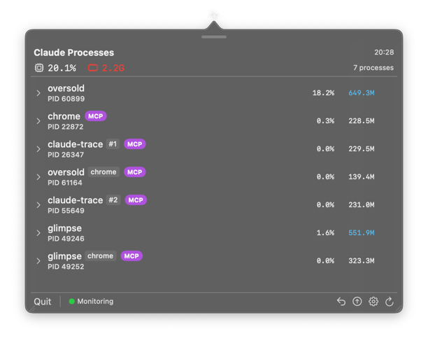
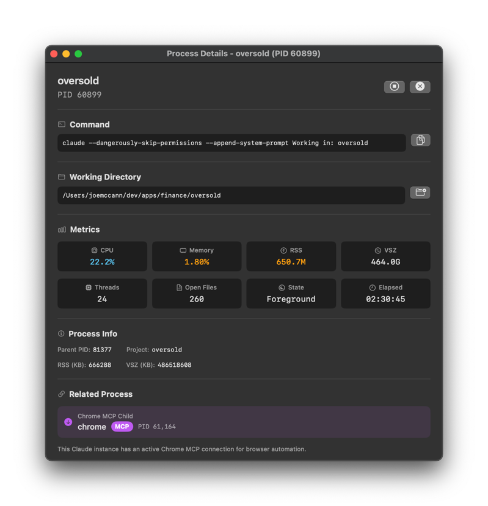

<p align="center">
  
</p>

<p align="center">
  <strong>Your Claude Code is slow. Here's why.</strong>
</p>

<p align="center">
  <a href="#menu-bar-app">Menu Bar App</a> •
  <a href="#features">Features</a> •
  <a href="#installation">Install</a> •
  <a href="#command-line">CLI</a> •
  <a href="docs/DIAGNOSTICS.md">Deep Diagnostics</a>
</p>

---

Stop guessing why Claude Code is eating your CPU. **Claude Trace** gives you instant visibility into every Claude process running on your machine—CPU spikes, memory leaks, runaway file watchers, orphaned processes—all in your menu bar.

## Menu Bar App

A native macOS app that lives in your menu bar. Always watching, never in the way.

<!-- SCREENSHOT: Menu bar dropdown showing process list with CPU/memory stats -->
<p align="center">
  
  <br />
  <em>See all your Claude sessions at a glance</em>
</p>

### Highlights

- **Live CPU & Memory** — Real-time stats for every Claude session
- **Project Names** — Know which project each session belongs to
- **Native Notifications** — Get alerted before your fans spin up
- **One-Click Kill** — Stop runaway processes instantly
- **Orphan Detection** — Find and clean up zombie sessions
- **Version Detection** — Know which sessions are running outdated Claude Code
- **Launch at Login** — Set it and forget it

<!-- SCREENSHOT: Settings panel showing threshold configuration -->
<p align="center">
  
  <br />
  <em>Configure thresholds to match your workflow</em>
</p>

### Outdated Version Detection

Spot processes running old versions of Claude Code. Claude Trace compares each running session against your installed version and flags any that need updating.

<!-- SCREENSHOT: Menu bar showing outdated processes with version badges -->
<p align="center">
  
  <br />
  <em>See which sessions are running old Claude versions</em>
</p>

### Notifications That Matter

Set thresholds for CPU and memory. Claude Trace watches in the background and alerts you when something's wrong—before your laptop becomes a space heater.

<!-- SCREENSHOT: macOS notification showing CPU threshold exceeded -->
<p align="center">
  
  <br />
  <em>Know immediately when Claude goes rogue</em>
</p>

### Process Details

Double-click any process to open a detailed view with full diagnostics, file descriptors, and thread info.

<!-- SCREENSHOT: Process detail window showing expanded info -->
<p align="center">
  
  <br />
  <em>Deep dive into any session</em>
</p>

## Features

| Feature | Description |
|---------|-------------|
| **Real-time Monitoring** | Polls every 2 seconds (configurable) |
| **Project Detection** | Shows project name for each Claude session |
| **Aggregate Stats** | Total CPU and memory across all sessions |
| **Orphan Detection** | Identifies Claude processes without a parent |
| **Outdated Detection** | Flags sessions running old Claude versions |
| **Threshold Alerts** | Configurable per-process and aggregate limits |
| **Process Tree** | Visualize parent-child relationships |
| **One-Click Kill** | Stop individual processes or kill all |
| **JSON Export** | Pipe to jq for custom analysis |
| **Launch at Login** | Auto-start with macOS |

## Installation

```bash
# Clone
git clone https://github.com/joemccann/claude-trace.git ~/claude-trace
cd ~/claude-trace

# Build and install everything
./dev.sh deploy
```

This builds the CLI and installs the menu bar app to `/Applications`.

### Requirements

- macOS 14.0 (Sonoma) or later
- Xcode 15.0+ (for building)

## Command Line

For quick checks without opening the app:

```bash
# See all Claude processes
claude-trace

# Watch mode — live updates every 2 seconds
claude-trace -w

# Verbose mode — includes project name and working directory
claude-trace -v

# JSON output for scripting
claude-trace -j | jq '.totals.cpu_percent'
```

<p align="center">
  
</p>

### CPU Spike? Go Deep.

When you spot a high-CPU process, use the Rust-powered diagnostics tool:

```bash
# Stack sampling + file descriptor analysis
./cli/target/release/claude-diagnose --pid <PID> -d -s

# Generate a flamegraph
sudo ./cli/target/release/claude-diagnose --pid <PID> -D --flamegraph -o debug.svg
```

See [Deep Diagnostics](docs/DIAGNOSTICS.md) for the full toolkit.

## Documentation

| Doc | Description |
|-----|-------------|
| [CLI Reference](docs/CLI.md) | All flags, output fields, and scripting examples |
| [Deep Diagnostics](docs/DIAGNOSTICS.md) | Stack sampling, DTrace, flamegraphs |
| [Development](docs/DEVELOPMENT.md) | Building, testing, contributing |
| [Troubleshooting](docs/TROUBLESHOOTING.md) | Common issues and fixes |

## Why Claude Trace?

Claude Code runs multiple Node.js processes. Sometimes they spin. Sometimes they leak memory. Sometimes they get orphaned. **Claude Trace** makes the invisible visible—so you can kill what needs killing and get back to work.

---

<p align="center">
  <strong>Built with Bash + Rust + Swift</strong>
  <br />
  Zero dependencies. Native performance.
</p>

## License

MIT
